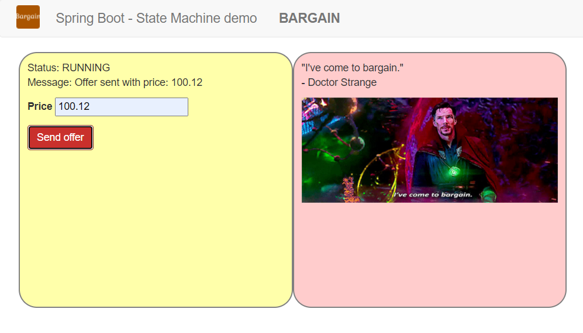

# Spring State Machine demo - Bargain

Simple demo application based on [Spring State Machine](https://projects.spring.io/spring-statemachine/)

# Detailed descripition
* [hungarian documentation](./docs/descr_hu.md)
* [english documentation](./docs/descr_en.md)

## Screenshot

[](https://app.fossa.com/projects/git%2Bgithub.com%2Flsmhun%2Fsm-demo?ref=badge_shield)

## Installation

You need Java11 installed in advance. Then you can run it as a regular Spring Boot web application.

```bash
$ ./mvnw spring-boot:run
```

[](https://www.travis-ci.com/lsmhun/sm-demo)
[](https://codecov.io/github/lsmhun/sm-demo?branch=main)


## License
[](https://app.fossa.com/projects/git%2Bgithub.com%2Flsmhun%2Fsm-demo?ref=badge_large)