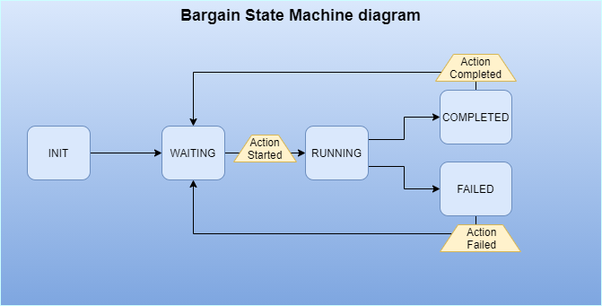
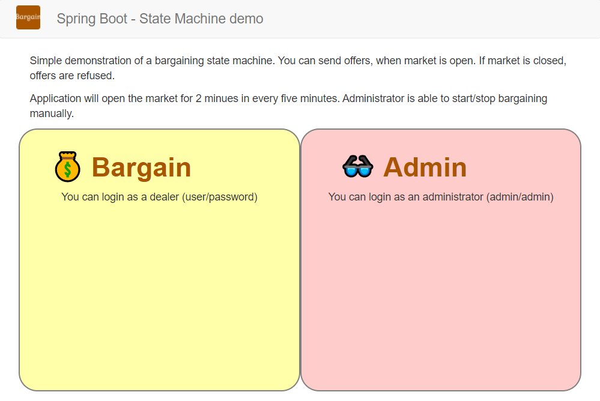
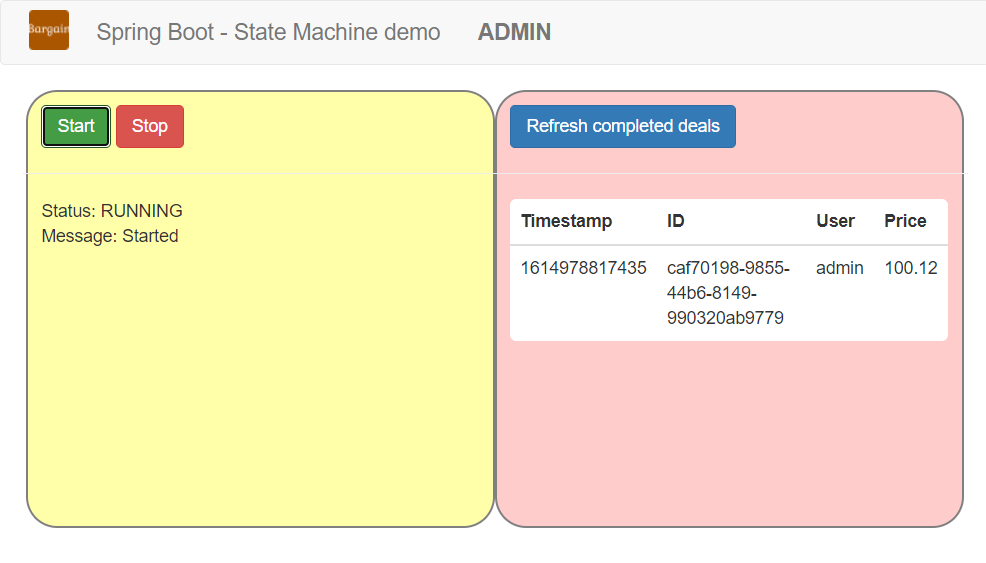

Spring State Machine demo application
=====================================

This demo application presents [Spring State Machine](https://projects.spring.io/spring-statemachine/).
State machine is an ancient design pattern, but it's widely used and sometimes
it can be handy.

Abstract
--------
This application implements a simple auction. If market is open, cusomers
can send offers. At end of business minutes it will evaluate the results. Best
price will win. In case of equal offers it will use the 'First come, first
served' rule.

Two actors are defined: user and administrator. User can write price, nothing
more. User offers are accepted when market is open.

There is scheduled start in every five minutes, with two minutes long trading 
window, but Administrator can start and stop the market manually. In addition
to that administrator is able to get finished deals.

State Machine
-------------
Application's state machine is available on pictur below. Implementation is in 
[StateMachineConfig](../src/main/java/hu/lsm/smdemo/configuration/StateMachineConfig.java)
class. Do not forget *@EnableStateMachine* annotation in main Spring Boot class.
([SmDemoApplication](../src/main/java/hu/lsm/smdemo/SmDemoApplication.java))



Basic Spring State machine elements:  *State, Event, Transition, Guard, Action, Fork and
Join* Some of them are obvious. Transition is the most important, because it defines 
the acceptable changes and behaviours. Conditions are supported by Guards, more tasks
are supported by Fork and Join.

```java
// example Transiton definition
transition.withExternal()
        .source(AppState.RUNNING)
        .target(AppState.COMPLETED)
        .event(AppEvent.COMPLETE)
        .action(valamiAction)
```
Actions can be attached to Transitions or States. It implements standalone 
functionality.

It is worth to mention *stateContext.getExtendedState().getVariables()*
Map. All data in this map are available in state machine context from
different sources. Now it stores just bargain startup timestamp, but 
it has much more possibilities.

I would recommend to take a look at
[Spring State Machine dokumentation](https://docs.spring.io/spring-statemachine/docs/2.4.x/reference/#statemachine-examples)
.

A quick summary about our application states. 
* INIT : just bootstrap
* WAITING : base camp state :)
* RUNNING : market is open, offers accepted
* COMPLETED : minimum one valid offer arrived
* FAILED : no offer arrived

State Machine is available just through 
[StateMachineManager](../src/main/java/hu/lsm/smdemo/service/StateMachineManager.java)
class. It will be used by Dependency Injection.

State Machine test is not always trivial. For state transition tests there is Listener, 
which is able to save the states in a list. After that it's easy to validate the changes.

Security
--------

We need to differentiate user and administrator, so we need authentication and 
authorization. Just for this demo BasicAuth was used. _It is not recommended in 
production!_

When Spring Boot security was added to dependency list, it has been activated
automatically. It can be surprise sometimes.

[SecurityConfig](../src/main/java/hu/lsm/smdemo/configuration/SecurityConfig.java)
class describe all security related configuration. Spring Boot has default configs
for everything ([itt](https://dzone.com/articles/spring-security-basic-authentication-example-1)),
however if it is not the wanted behaviour, then do not forget disable auto configuration.

```java
@SpringBootApplication(exclude = {
		SecurityAutoConfiguration.class,
		ManagementWebSecurityAutoConfiguration.class
})
```

Based on [this](https://www.javadevjournal.com/spring/basic-authentication-with-spring-security/)
article it's not impossible to create a working setup.

Secure page testing is not obvious, 
[SecurityConfigTest](../src/test/java/hu/lsm/smdemo/integration/configuration/SecurityConfigTest.java)
implementation can be good entry point. If secure access is not needed,
then it can be disabled:

```java
@AutoConfigureMockMvc(addFilters = false)
```

Web UI
------
It is immediately visible, that Frontend is not a strenght in this app.
But a minimal UI is still better for a demo compare to Swagger REST API.

[VueJS](https://vuejs.org/) is a comfortable tool for small web applications,
it can cover our minimal REST requests.

Current state is continously polled in every five seconds. It is not a real
reactive solution, but this is not the focus now. 
[offer](../src/main/resources/static/offer/offer.html) page uses the Javascript's
scheduler with Vue *created()* function.

```javascript
var app = new Vue({
    el: '#app',
    data() { 
      ...
      timer: ''
    },
    methods: {
      ...
      getCurrentState: function() {...}
    },
    created () {
        this.getCurrentState();
        this.timer = setInterval(this.getCurrentState, 5000);
    }
});
```

Favicon was generated by [https://favicon.io/favicon-generator/](https://favicon.io/favicon-generator/).

Screenshots
--------------




Articles
------------------
* [Spring State Machine dokumentáció](https://docs.spring.io/spring-statemachine/docs/2.4.x/reference/#statemachine-examples)
* Articles from [Baeldung](https://www.baeldung.com/)